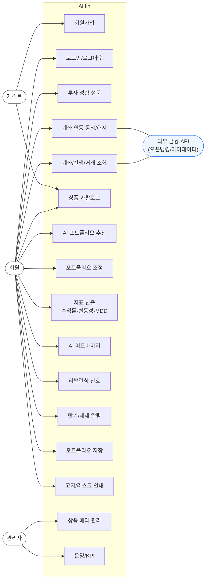

```mermaid
flowchart LR
  %% Actors
  Guest(["게스트"]):::actor
  User(["회원"]):::actor
  Admin(["관리자"]):::actor
  ExtAPI(["외부 금융 API<br/>(오픈뱅킹/마이데이터)"]):::external

  %% System boundary
  subgraph AIFIN["Ai fin"]
    UC_SignUp[회원가입]
    UC_Login[로그인/로그아웃]
    UC_RiskSurvey[투자 성향 설문]
    UC_LinkAcct[계좌 연동 동의/해지]
    UC_AcctQuery[계좌/잔액/거래 조회]
    UC_ProductInfo[상품 카탈로그]
    UC_AIRec[AI 포트폴리오 추천]
    UC_Adjust[포트폴리오 조정]
    UC_Simulate[지표 산출<br/>수익률·변동성·MDD]
    UC_Advisor[AI 어드바이저]
    UC_RebalSig[리밸런싱 신호]
    UC_Alerts[만기/세제 알림]
    UC_Save[포트폴리오 저장]
    UC_Disclaimers[고지/리스크 안내]
    UC_CMS[상품 메타 관리]
    UC_Ops[운영/KPI]
  end

  %% Relations
  Guest --> UC_ProductInfo
  Guest --> UC_SignUp

  User --> UC_Login
  User --> UC_RiskSurvey
  User --> UC_LinkAcct
  User --> UC_AcctQuery
  User --> UC_ProductInfo
  User --> UC_AIRec
  User --> UC_Adjust
  User --> UC_Simulate
  User --> UC_Advisor
  User --> UC_Save
  User --> UC_RebalSig
  User --> UC_Alerts
  User --> UC_Disclaimers

  Admin --> UC_CMS
  Admin --> UC_Ops

  %% External
  UC_LinkAcct --- ExtAPI
  UC_AcctQuery --- ExtAPI

  %% Styles (최소화)
  classDef actor fill:#fff,stroke:#666,stroke-width:1px;
  classDef external fill:#eef7ff,stroke:#3b82f6,stroke-width:1px;

```
