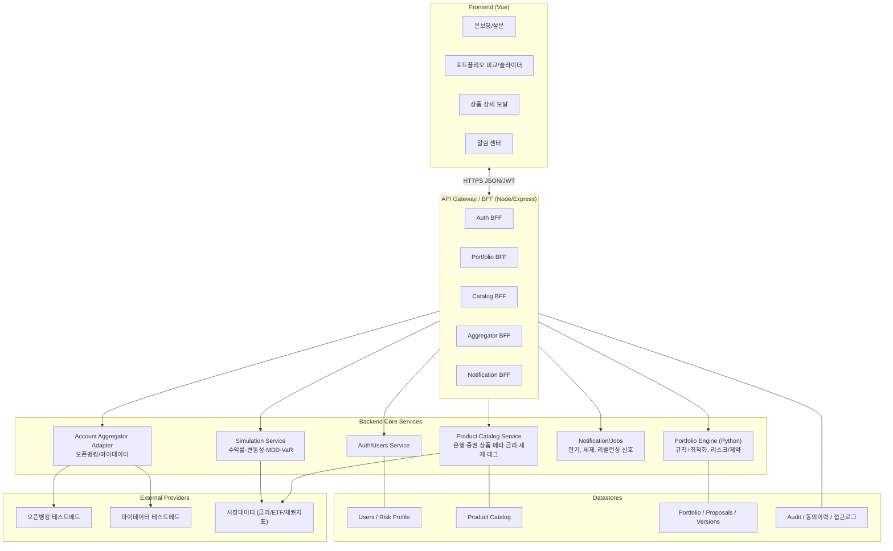

```mermaid
flowchart TB
  subgraph Client["Frontend (Vue)"]
    OB["온보딩/설문"]
    PF["포트폴리오 비교/슬라이더"]
    PD["상품 상세 모달"]
    AC["알림 센터"]
  end

  subgraph Edge["API Gateway / BFF (Node/Express)"]
    AUTHBFF["Auth BFF"]
    PF_BFF["Portfolio BFF"]
    CAT_BFF["Catalog BFF"]
    AGG_BFF["Aggregator BFF"]
    NOTI_BFF["Notification BFF"]
  end

  Client <-->|HTTPS JSON/JWT| Edge

  subgraph Core["Backend Core Services"]
    AUTH["Auth/Users Service"]
    CATALOG["Product Catalog Service<br/>은행·증권 상품 메타·금리·세제 태그"]
    ENGINE["Portfolio Engine (Python)<br/>규칙+최적화, 리스크/제약"]
    SIM["Simulation Service<br/>수익률·변동성·MDD·VaR"]
    NOTI["Notification/Jobs<br/>만기, 세제, 리밸런싱 신호"]
    AGG["Account Aggregator Adapter<br/>오픈뱅킹/마이데이터"]
  end

  Edge --> AUTH
  Edge --> CATALOG
  Edge --> ENGINE
  Edge --> SIM
  Edge --> NOTI
  Edge --> AGG

  subgraph Data["Datastores"]
    UDB["Users / Risk Profile"]
    PDB["Product Catalog"]
    PRDB["Portfolio / Proposals / Versions"]
    LOGDB["Audit / 동의이력 / 접근로그"]
  end

  AUTH --- UDB
  CATALOG --- PDB
  ENGINE --- PRDB
  Edge --- LOGDB

  subgraph External["External Providers"]
    OBK["오픈뱅킹 테스트베드"]
    MDATA["마이데이터 테스트베드"]
    MKT["시장데이터 (금리/ETF/채권지표)"]
  end

  AGG --> OBK
  AGG --> MDATA
  SIM --> MKT
  CATALOG --> MKT

```
